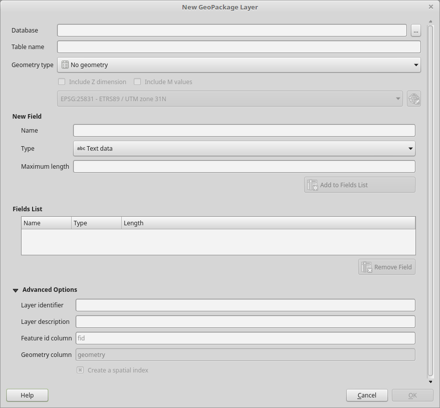
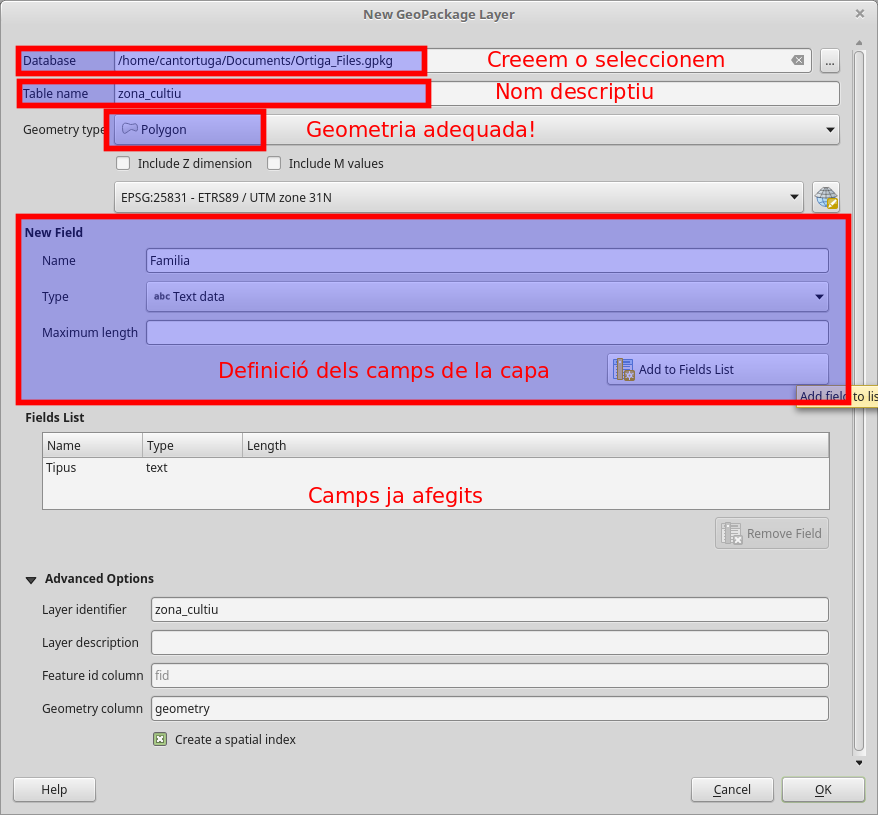

.. _AfegirCapes:

******************************
Les nostres capes geogràfiques
******************************

Base de dades GeoPackage
########################

Per tal de mantenir les nostres capes geogràfiques en una forma compacte farem servir
el format `GeoPackage <https://www.geopackage.org/>`_

.. image:: _static/img/geopkg.png
	:width: 150px
	:align: center

Es una petita Base de Dades portàtil, que integra la capacitat de emmagatzemar dades geoespaials.

Aquest format ens permet guradar varies capes geogràfiques (o només alfanumèriques) en un sol arxiu.
No importa si tenen sistemes de coordenades diferents, o si sòn vectorials o ràsters.

D'aquesta manera podrem compartir les nostres capes espaials sense problemes entre ordinadors i sòcies.

Està basada en el format SQlite, en el que es basen també tots els SmartPhones moderns.

Com creeem una capa?
####################

Facil!!

**Pestanya "Capa" -> "Crear Capa" -> "Nova capa GeoPackage"**

.. image:: _static/qgis-img/NewGeoPackageLayer.png
	:align: center

I se'ns obre el següent panell:

Quins camps necessitem?
***********************

La gran pregunta! 

Aquest és el moment on ens hem de para a pensar que necessitem per a aquest projecte, tenint en compte que ara vivim en
el fantàstic món del GIS!

Que necessitem saber de les nostres capes geogràfiques?

* Que estàn representant?
* Quin tipus de geometria necessitem?
* Quin atributs geomètrics tenen?
* Quins atributs No geometrics volem emmagatzemar?

