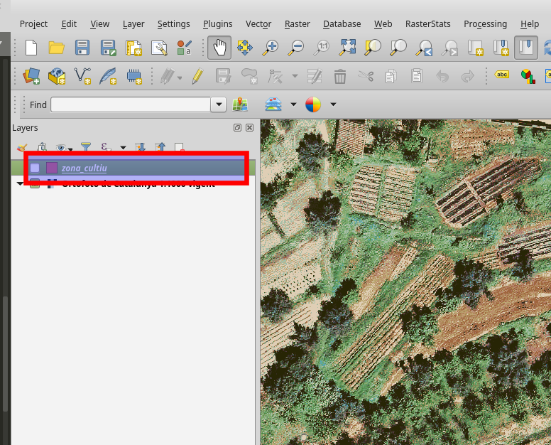
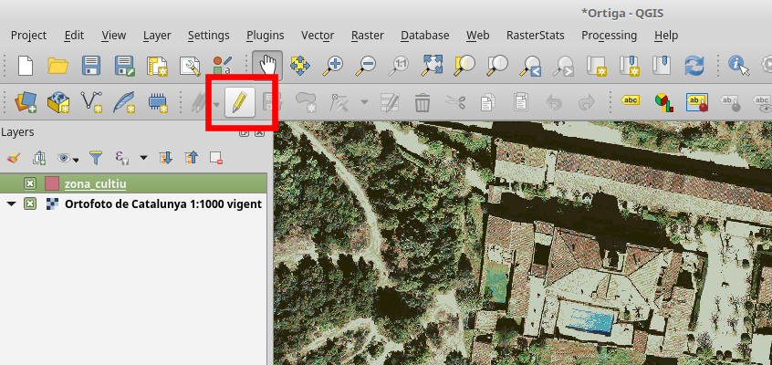
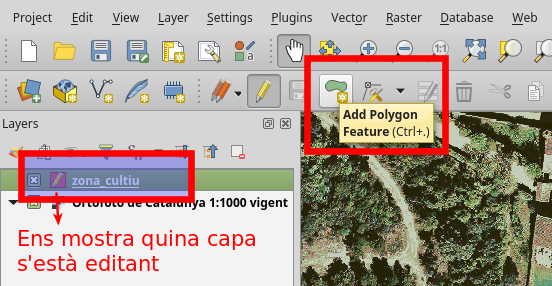
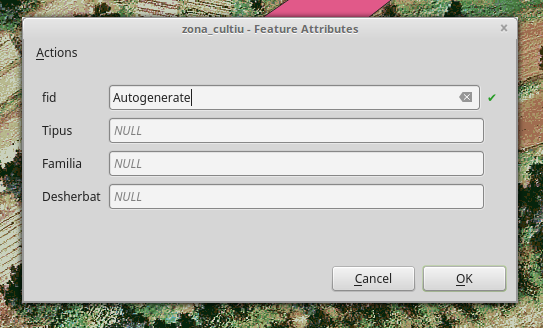

.. _AfegirCapes:

******************************
Les nostres capes geogràfiques
******************************
|

Base de dades GeoPackage
########################

Per tal de mantenir les nostres capes geogràfiques en una forma compacte farem servir
el format `GeoPackage <https://www.geopackage.org/>`_

.. image:: _static/img/geopkg.png
	:width: 150px
	:align: center

Es una petita Base de Dades portàtil, que integra la capacitat de emmagatzemar dades geoespaials.

Aquest format ens permet guradar varies capes geogràfiques (o només alfanumèriques) en un sol arxiu.
No importa si tenen sistemes de coordenades diferents, o si sòn vectorials o ràsters.

D'aquesta manera podrem compartir les nostres capes espaials sense problemes entre ordinadors i sòcies.

Està basada en el format SQlite, en el que es basen també tots els SmartPhones moderns.

|

Com creeem una capa?
####################

Facil!!

**Pestanya "Capa" -> "Crear Capa" -> "Nova capa GeoPackage"**

|

.. image:: _static/qgis-img/NewGeoPackageLayer.png
	:align: center

|

I se'ns obre el següent panell:

|

.. image:: _static/qgis-img/NewGeoPackageLayer_Panel.png
	:align: center

|

Quins camps necessitem?
***********************

La gran pregunta! 

.. note:: Aquest és el moment on ens hem de para a pensar que necessitem per a aquest projecte, tenint en compte que ara vivim en
 el fantàstic món del GIS!

Que necessitem saber de les nostres capes geogràfiques?

* Que estàn representant?
* Quin tipus de geometria necessitem?
* Quin atributs geomètrics tenen?
* Quins atributs No geometrics volem emmagatzemar?

Dels atributs geomètrics no ens n'haurem de preocupar gaire, QGis farà tota la feina per nosaltres,
sempre qel nostre amic **25831** estigui content.

La clau està en els atributs no geomètrics (alfanumerics). Per definir una capa que representi els diferents bancals/camps de cultiu,
un esquelet molt senzill podria ser aquest:

Capa:
	- zona_cultiu
Camps:
	- Tipus (Elevat, Tradicional,...)
	- Familia (Brasicàcies, Enciams, Lleguminoses)
	- Desherbat (Manual, Biciaixada, Motocultor)

|

Evidentment cada projecte tindrà les seves partiularitats. Serà molt diferent un projecte per a generar un mapa
per a un concurs, o un projecte de gestió interna dels horts.

.. warning:: Els apòstrofs són molt nostres, ho sé. Però per favor, **no els utilitzeu mai**
 per definir camps, o en els valors registrats, només porten problemes

|

.. note:: De la mateixa manera procurem no tenir carpetes a l'ordinador que continguin espais al seu nom

Per a aquest primer exemple:

|

.. image:: _static/qgis-img/NewGeoPackageLayer_Edited.png
	:align: center

|

Tipus de camps
***************

A l'hora de definir un camp, hem de concretar bé quin tipus de dada contindrà. Bàsicament:

- Text (String)
- Nombres enters (Int)
- Decimals (Float)

.. note:: Simplement tenir-ho en compte.

.. warning:: No podrem barrejar formats (per exemple text amb decimals), així com canviar el tipus de camp
 un cop ja estigui definit

|

Un cop definida la capa, ja la tindrem accesible al lateral esquerra de QGis

|

|

Introduïr dades
***************

Primer de tot caldrà habilitar l'edició de la capa.

Clickem al botó del panell, o boto dret al panell de selecció de capes.

Observem com ara se'ns activen altres funcionalitats:

Si clickem al botó d'afegir elements, ja serem capaces de generar, en aquest cas, polígons

Un cop definim el poligon podrem entrar ja les preuades dades alfanumèriques

