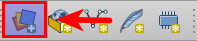
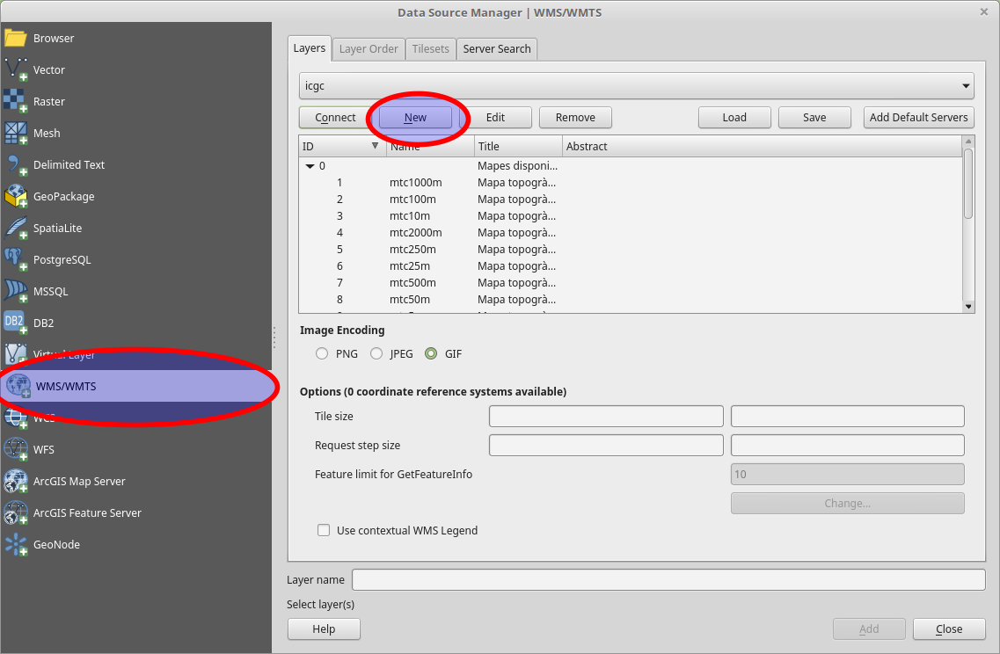
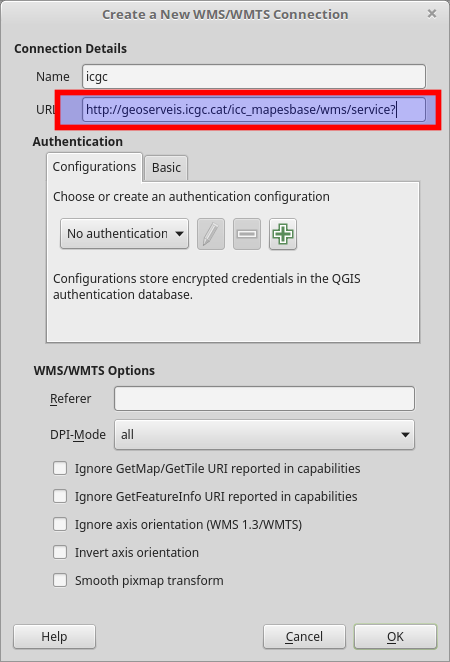
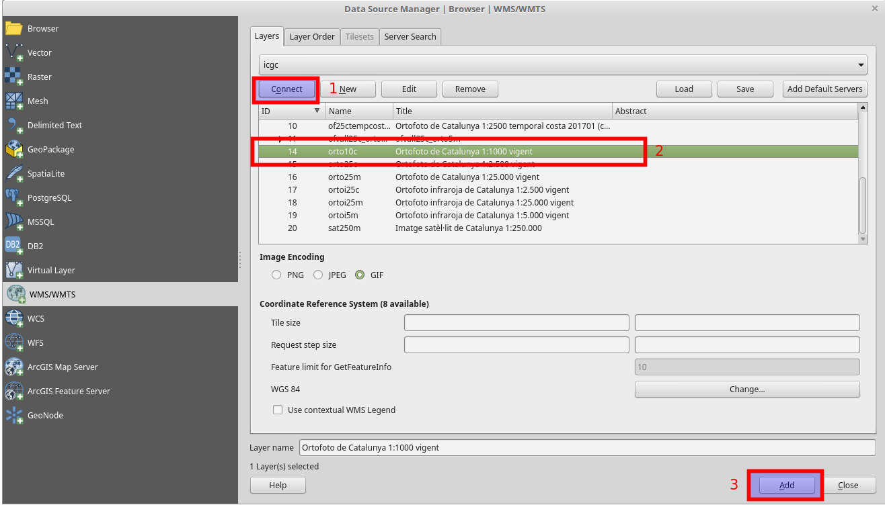
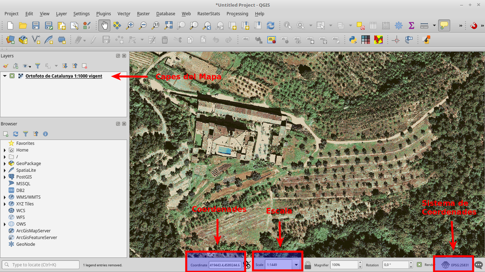

.. _MapesBase:

**********
Mapes base
**********

Com afegir mapes base a QGIS
############################

.. note:: Qgis treballa per capes (layers) igual que Photoshop. 

Primer de tot hem de configurar una nova font de dades pel projecte. Pels mapes que volem generar, 
en general **l'Institut Cartogràfic i Geològic de Catalunya (ICGC)** serà una font excel·lent de dades.

Tant si volem posar Ortofotos o Topogràfics de base del nostre projecte, he de conèixer primer d'on descarregar
les tesel·les d'imatges que ens interessen. 

Possibles fonts: 

* `ICGC <https://www.icgc.cat/Administracio-i-empresa/Serveis/Geoinformacio-en-linia-Geoserveis/WMS-i-tessel-les-Cartografia-de-referencia/WMS-Mapes-i-ortofotos-vigents>`_
* `IDEE <http://www.idee.es/ca_ES/directorio-de-servicios?p_p_id=DIRSRVIDEE_WAR_DIRSRVIDEEportlet_INSTANCE_KXnVu4qMJc1J&p_p_lifecycle=1&p_p_state=normal&p_p_mode=view&p_p_col_id=column-1&p_p_col_count=1&_DIRSRVIDEE_WAR_DIRSRVIDEEportlet_INSTANCE_KXnVu4qMJc1J_tipoServicio=WMS&_DIRSRVIDEE_WAR_DIRSRVIDEEportlet_INSTANCE_KXnVu4qMJc1J_supertipo=OGC&_DIRSRVIDEE_WAR_DIRSRVIDEEportlet_INSTANCE_KXnVu4qMJc1J_tipoAmbito=ESTATAL&_DIRSRVIDEE_WAR_DIRSRVIDEEportlet_INSTANCE_KXnVu4qMJc1J_descSrv=VISUALIZACION>`_

1. Cliquem l'icona del Gestor de Origens de Dades

2. Escollim el servei WMS i creeem una nova conexió

3. Configurem la URL del servei escollit

	Per exemple: ``http://geoserveis.icgc.cat/icc_mapesbase/wms/service?``

.. note:: Aquest procés només farà falta fer-lo un cop per a cada ordinador.
 El recurs WMS quedarà emmagatzemat i serà accessible per a tots els nous projectes que fem

4. Conectem, seleccionem el recurs que volguem, i l'afegim al llenç (canvas)

===============================================

Ara ja podem veure la nostra base per el mapa.

.. note::Cal tenir en compte que aquests recursos són públics, oberts i gratuïts.
 En el cas del ortofotografic 1:1000, no està disponible per a la totalitat del terriotri català.

.. warning:: Fixeu-vos en el nostre amic! Estem en coordenades projectades?

